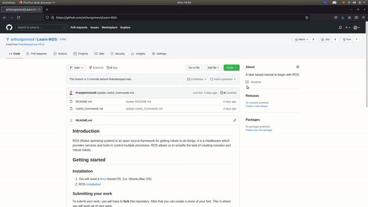

## Introduction
ROS (Robot operating system) is an open source framework for getting robots to do things. It is a middleware which provides services and tools to control multiple processes.  ROS allows us to simplify the task of creating complex and robust robots.

## Getting started  

### Installation  
1. You will need a [linux](https://ubuntu.com/tutorials/install-ubuntu-desktop#1-overview) based OS. (i.e. Ubuntu,Mac OS)  
2. ROS [installation](http://wiki.ros.org/noetic/Installation/Ubuntu)

### Submitting your work
* To submit your work, you will have to **fork** this repository. After that you can create a clone of your fork. This is where you will push all of your work.  
You will have to update your **fork** from time to time. You can do this from the terminal or the github website.  
   * Follow [this](https://gist.github.com/CristinaSolana/1885435) to add the remote from the original repo using the terminal.  
   * Updating fork using the github website.  
   

* For each task submission, you should add the ROS package that you created. This should include all the scripts/codes that you have used. Also include a README with relevent screenshots to validate your work. Checkout the Sample Submission [here](Sample_Submission/README.md)  

## Tasks
Tasks on this repository are arranged in a weekly manner, similar to any online course or MOOC that you may have taken.(Coursera,Udemy,edX)  

### Task 0: 
1. Install your OS.  
2. Install ROS.  
   Verify your installation by running the command `roscd`  

### Task 1:  
1. Create a catkin workspace. Go through all sub-directories and understand their significance.  
2. Create a ROS package.  
3. Launch the turtlesim node and explore its messages and topics.  
4. Publish a ROS package for a simple publisher subscriber node in python (talker-listener).  

### Task 2:  
1. Understand the significance of the talker and listener scripts. Implement them in both python and C++. 
2. Modify the talker-listener nodes to send data of different types. (int,bool and char)  
3. Create a custom msg and use the Pub-Sub model to send your msg.  

### Task 3:  
1. Create a ROS node to control the turtlesim bot. (Move,Rotate,Go to goal)  
2. Write a script to draw the letter 'D' using the turtle bot.  
3. Write a script to draw a hexagon using the turtle bot.  

### Task 4:  
1. Learn about [rosserial](http://wiki.ros.org/rosserial). Go through the tutorials and implement the example code, then use it to send data from an ultrasonic sensor.  
*Note* : If you don't have this sensor you can use any other sensor as well. You can also expand this exercise to other electronic modules and sensors.  

### Task 5:  
1. Understand the client server model and how it works in ROS.  
2. Write a client server node (in C++ and python). Edit the basic code to send different data.  

## Resources  
1. Official ROS [documentation](http://wiki.ros.org/)
2. Official [ROS](http://wiki.ros.org/ROS/Tutorials) tutorials.  

## Tutorials  
1. What is [ROS](https://www.youtube.com/watch?v=8QfI5a7lTKU)  
2. Quick start [ROS guide](https://www.youtube.com/playlist?list=PLud1D2wIGgfpIyF_6pYBn-agISpbJjGpf)  
3. Free ROS [course](https://www.youtube.com/playlist?list=PLRG6WP3c31_U7TFGduEIJWVtkOw6AJjFf)  
4. ROS essentials on [Udemy](https://www.udemy.com/course/ros-essentials/)  
