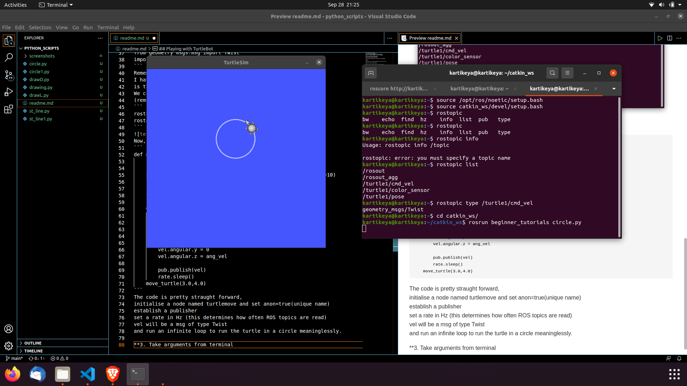
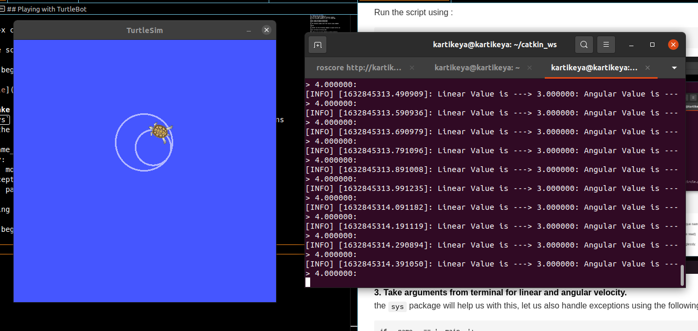
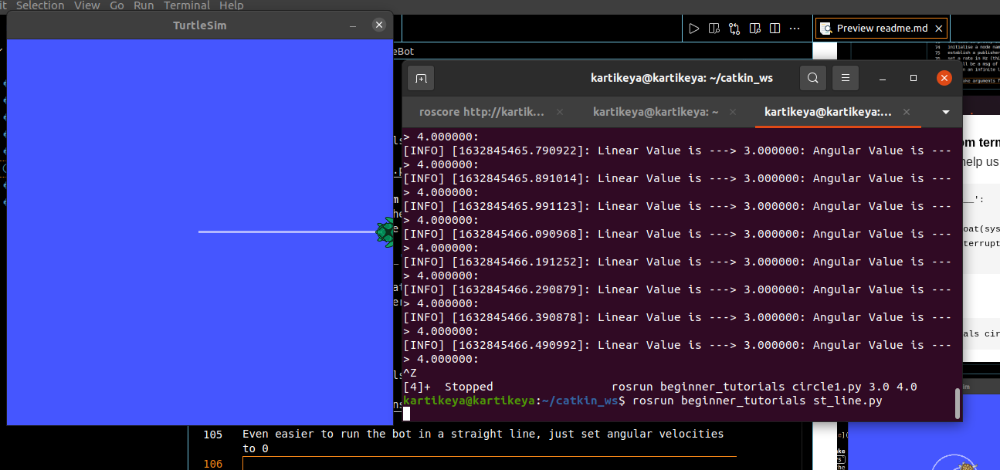
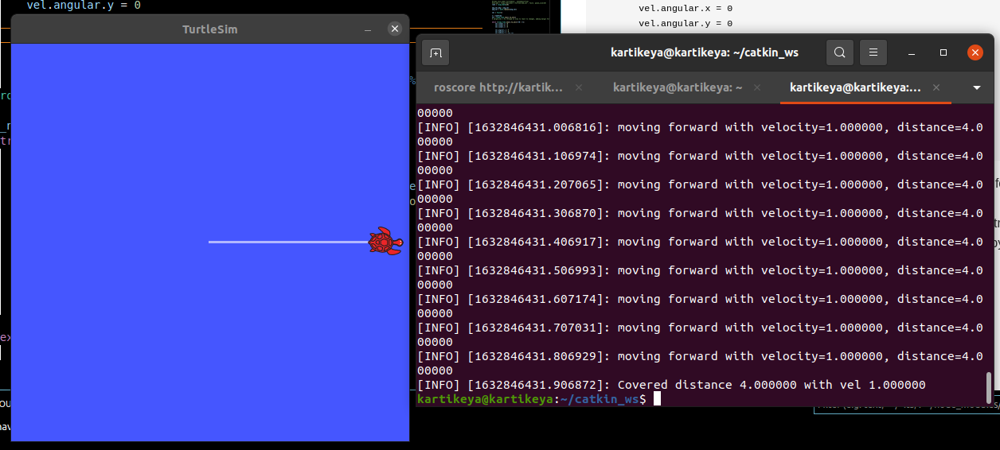
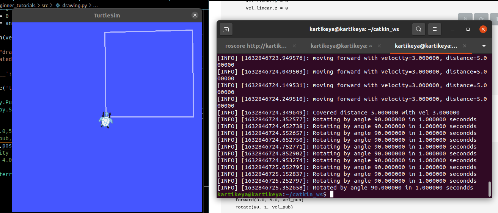
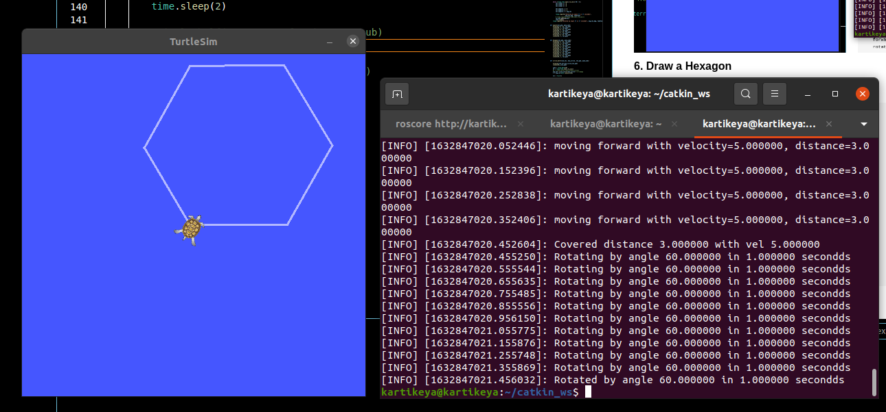
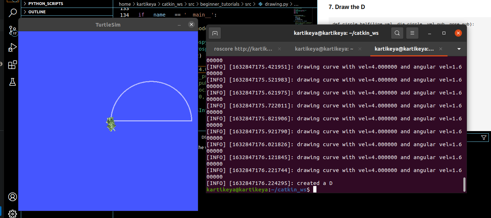
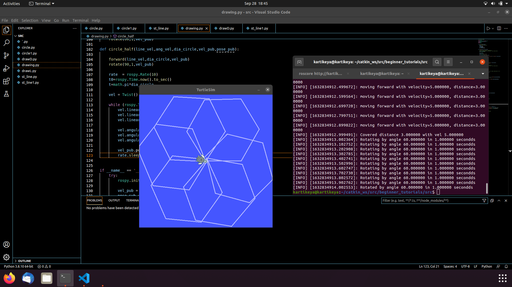

## Playing with TurtleBot  
**1. Setting Up Environment.**  
First of all, open 3 seperate terminal windows  
Run the following commands in all 3 to setup ROS  
~~~  
source /opt/ros/noetic/setup.bash  
source catkin_ws/devel/setup.bash  
~~~  
In one terminal window start the roscore using command 
~~~
roscore 
~~~  
In another use the following command to launch turtle sim  
~~~
rosrun turtlesim turtlesim_node
~~~  
Note that we can use the command to control manually  
~~~
rosrun turtlesim turtlesim_teleopkey  
~~~  
(make sure that you are operating in the catkin_ws)    
  
    

**2. Create a simple python script to drive the turtle in a circle.**  
Before moving forward, make a catkin_ws to run python scripts and make sure to use
~~~
catkin_make
~~~  
create an empty python file `circle.py` and save it in a catkin package  
```
cd catkin_ws/src/turleBotPlay/scripts
```  
Now, open circle.py  
```
#!/usr/bin/env python3

import rospy
from geometry_msgs.msg import Twist
import sys
```  
First line is `shebang`. Do not ask questions, just write it.  

Remember, msg is nothing but a data type for ROS topics.  
I have imported the particular msg because I learnt that this  
is the data type used by the turtlebot for movement.  
We can know about ROS topics using following commands  
(remember double tab to know more about commands)  
```
rostopic list
rostopic type /turtle1/cmd_vel
```

Now, back to python script  
```  
def move_turtle(line_vel,ang_vel):

    rospy.init_node('turtlemove',anonymous=True)
    pub = rospy.Publisher('/turtle1/cmd_vel', Twist, queue_size=10)
    rate  = rospy.Rate(10)

    vel = Twist()

    while True:
        vel.linear.x = line_vel
        vel.linear.y = 0 
        vel.linear.z = 0

        vel.angular.x = 0
        vel.angular.y = 0
        vel.angular.z = ang_vel

        pub.publish(vel)
        rate.sleep()
    move_turtle(3.0,4.0)
```  
The code is pretty straught forward,  
Initialise a node named turtlemove and set anon=true(unique name)  
Establish a publisher  
Set a rate in Hz (this determines how often ROS topics are read)  
`vel` will be a `msg` of type `Twist`  
and run an infinite loop to run the turtle in a circle meaninglessly.  

Do not forget to make python script executable. Navigate to folder and type :  
``` 
chmod +x circle.py
```
Run the script using :
``` 
rosrun beginner_tutorials circle.py  
```   

  
**3. Take arguments from terminal for linear and angular velocity.**
the `sys` package will help us with this, let us also handle exceptions using the following code :
```
if __name__ == '__main__':
    try:
        move_turtle(float(sys.argv[1]),float(sys.argv[2]))
    except rospy.ROSInterruptException:
        pass
```
Run using 
``` 
rosrun beginner_tutorials circle1.py 3.0 2.0
``` 
  
**4. Straight Line.**
Even easier to run the bot in a straight line, just set angular velocities to 0  
      
  

**5. Drawing Square**  
Let us create a function that can determine distance of our bot.  
For this we need some extra topics, namely Pose.  
```
#!/usr/bin/env python3

import rospy
from geometry_msgs.msg import Twist
from turtlesim.msg import Pose
import sys
import math
import time
```
Pretty straight forward, moving on to function.  
``` 
def position_bot(pose_msg):
    # for rostopic /turtle1/Pose
    global x
    global y, yaw
    x = pose_msg.x
    y = pose_msg.y
    yaw = pose_msg.theta

def forward(line_vel, dist, vel_pub):

    #rospy.init_node('turtlemove', anonymous=True)
    #vel_pub = rospy.Publisher('/turtle1/cmd_vel', Twist, queue_size=10)
    rate = rospy.Rate(10)

    vel = Twist()

    t = dist/line_vel               #speed=distance/time
    t0 = rospy.Time.now().to_sec()  #time at start

    while (rospy.Time.now().to_sec()-t0 < t):

        rospy.loginfo(
            "moving forward with velocity=%f, distance=%f", line_vel, dist)
        vel.linear.x = line_vel
        vel.linear.y = 0
        vel.linear.z = 0

        vel.angular.x = 0
        vel.angular.y = 0
        vel.angular.z = 0

        vel_pub.publish(vel)
        rate.sleep()

    rospy.loginfo("Covered distance %f with vel %f", dist, line_vel)
    # rospy.loginfo(rospy.Time.now().to_sec())

```
`rospy.loginfo()` does 3 things, we are mainly using it as sanity check for now to print whatever the bot is doing on terminal screen.
We make use of `rospy.Time` to figure out the distance that our bot has travelled. Make sure that the distance that our bot travels is measured in `<` or `>` and not `==` as rospy is not pin point accurate.  
**Pro tip: DO NOT initialise your node in function. I learnt it the hard way.  
Make sure to navigate to folder and make the file executable
`chmod +x drawing.py`   
and run it using :  
`rosrun beginner_tutorials drawing.py`


Function to rotate:
```
def rotate(ang_vel, takeTime, vel_pub):

    #rospy.init_node('turtlemove', anonymous=True)
    #vel_pub = rospy.Publisher('/turtle1/cmd_vel', Twist, queue_size=10)
    rate = rospy.Rate(10)

    ang_vel_deg = ang_vel
    ang_vel = math.radians(ang_vel)

    vel = Twist()

    t = takeTime
    t0 = rospy.Time.now().to_sec()
    # margin_sec = 0.1 #rospy is slow to react to changes, adding margin for error

    while (rospy.Time.now().to_sec()-t0 < t):
        vel.linear.x = 0
        vel.linear.y = 0
        vel.linear.z = 0

        vel.angular.x = 0
        vel.angular.y = 0
        vel.angular.z = ang_vel

        rospy.loginfo("Rotating by angle %f in %f secondds",
                      ang_vel_deg, takeTime)
        # rospy.loginfo(rospy.Time.now().to_sec())
        vel_pub.publish(vel)
        rate.sleep()
    rospy.loginfo("Rotated by angle %f in %f secondds", ang_vel_deg, takeTime)
```
Again, straight forward code to rotate the bot. Just make sure your degrees are into radians.  
Not adding Screenshot, just take my word for it.  
  
  To Draw a Square, just mix and repeat and BOOM, square.
```
def square(vel_pub, pose_sub):
    forward(3.0, 5.0, vel_pub)
    rotate(90, 1, vel_pub)
    forward(3.0, 5.0, vel_pub)
    rotate(90, 1, vel_pub)
    forward(3.0, 5.0, vel_pub)
    rotate(90, 1, vel_pub)
    forward(3.0, 5.0, vel_pub)
    rotate(90, 1, vel_pub)
```
  
**6. Draw a Hexagon**
Rinse and Repeat
```
def hexagon(vel_pub, pose_sub):
    forward(5.0, 3.0, vel_pub)
    rotate(60, 1, vel_pub)
    forward(5.0, 3.0, vel_pub)
    rotate(60, 1, vel_pub)
    forward(5.0, 3.0, vel_pub)
    rotate(60, 1, vel_pub)
    forward(5.0, 3.0, vel_pub)
    rotate(60, 1, vel_pub)
    forward(5.0, 3.0, vel_pub)
    rotate(60, 1, vel_pub)
    forward(5.0, 3.0, vel_pub)
    rotate(60, 1, vel_pub)
```
  
  
  **7. Draw the D**
```
def circle_half(line_vel, dia_circle, vel_pub, pose_sub):

    forward(line_vel,dia_circle,vel_pub)
    rotate(90,1,vel_pub)

    rate = rospy.Rate(10)
    t0 = rospy.Time.now().to_sec()
    #t = (line_vel*2)/(math.pi*dia_circle)
    ang_vel= (line_vel*2)/dia_circle # v/r=omega
    t = ang_vel/math.radians(180)

    vel = Twist()

    while (rospy.Time.now().to_sec()-t0 < t+0.5):
        vel.linear.x = line_vel
        vel.linear.y = 0
        vel.linear.z = 0

        vel.angular.x = 0
        vel.angular.y = 0
        vel.angular.z = ang_vel

        vel_pub.publish(vel)
        rate.sleep()
        rospy.loginfo("drawing curve with vel=%f and angular vel=%f",line_vel,ang_vel)
    rospy.loginfo("created a D")
```
  
  
  **8. Make weird things because you have too much free time.**
